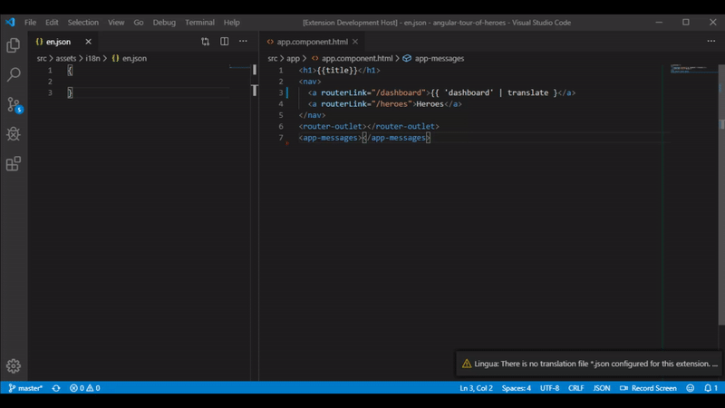
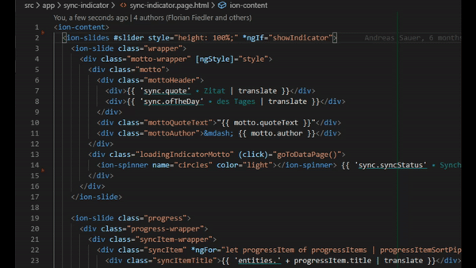

# Lingua: Managing nxg-translations

Lingua - a Visual Studio Code extension to help managing translations for [ngx-translate](https://github.com/ngx-translate/core) - a internationalization (i18n) library for Angular.

## Goals:

Lingua's goals is to help developers creating, and managing translations with ngx-translate, directly in the editor. With Lingua you can:

-   Create translations directly in your `html` or `ts` file
-   Change translation directly in your `html` or `ts` file
-   Lookup the translations in your editor
-   Autocomplete translation identifiers in `html`
-   Analyse translation usage (e.g. how many translations, how many unused translations, ...)
-   Find translations in your language-file

## Usage:

Lingua is automatically started when you work on an Angular project. But to use its features you first have to specify at least one language file (e.g. `en.json`, `de.json`, ...)

This is done by opening the [language].json file in the editor and selecting right-click context menu "_Set as language file_". Enter the language identifier, which you want to use (e.g. `en`) in the quick promt field. Lingua automatically creates a `.lingua` settings file in the root of your project.

> The first file you set as a language file will be your default language. This means mouse-over translations are generated from this language file. You can change the default in the settings with the `defaultLanguage` parameter

### Creating new translations

Write an identifier in your code like `'some.identifier'` for which you want to create a translation. Select or the identifier or place the cursor in it and open the context menu with right-click. Select `Lingua: Create translation`. You will be promted to enter a translation for this identifier, following with a promt to select the language for which you want to create this translation for.

### Changing translations

Change translations directly in your `html` or `ts` file by opening the context menu, selecting `Lingua: Change translation` and typing in a new translation for the current identifier.

### Go to a translation in your default language file

Select or an identifier or place the cursor in it and open the context menu with right-click. Select `Lingua: Go to translation` to get to the correct location in the default language file.

### Analysing translation usage

Hit `Ctrl+P` and enter the command `Lingua: analyse translation usage` to calculate some metrics about translations in your project. Metrics include:

-   Total amount of translations for each defined language
-   Total amount of partial translations
-   Ununsed or missing translations (translations that are not used in the project)

> Partial translations are identifiers that are resolved during runtime, e.g. in `'someIdentifier.${parameter}'` the word `someIdentifier` is recognized as a partial path in the translation.

### Configuration

Most of the Lingua settings are located under the extension settings in vscode.

Lingua also needs at least the location of one language file in order to work. If this file is selected a `.lingua` settings file will be created in the root of the project.
This file can be shared with collaborators on your project.

## Planned features:

-   [ ] Sync multiple lang-files
-   [ ] Import/Export Translations
